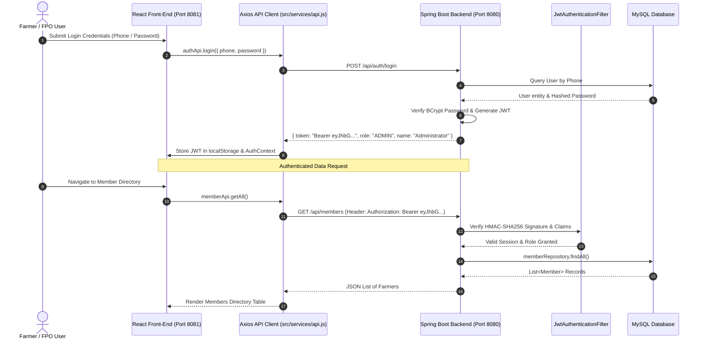
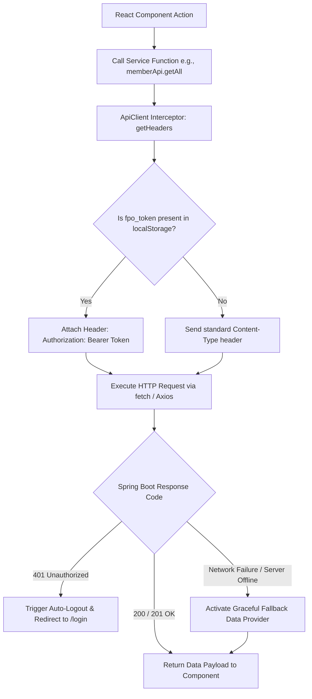

# Technical Integration Documentation: React + Spring Boot + MySQL

This document provides a comprehensive technical guide for integrating the **React.js Front-End Application** with the **Spring Boot REST API Backend** and **MySQL Relational Database** for the Agricultural Cooperative and Farmer Producer Organisation (FPO) Management System.

---

## 1. System Architecture Overview

The system follows an enterprise multi-tier architecture:
- **Presentation Layer (React.js)**: Runs on port `8081` (or Vite dev server `5173`). Built with React Router DOM v6/v7, Tailwind CSS, Lucide React icons, and Context API for authentication state.
- **Service Layer (Spring Boot 3.x)**: Runs on port `8080`. Implements Spring Security, JWT HMAC-SHA256 authentication, JPA repositories, and REST Controllers (`/api/auth`, `/api/members`, `/api/procurements`, `/api/sales-orders`, `/api/warehouse`, `/api/users`).
- **Persistence Layer (MySQL 8.0)**: Relational schema for agricultural cooperative records (`users`, `members`, `procurements`, `sales_orders`, `warehouses`).



---

## 2. Environment Configuration

### React Environment (`.env` / Vite Config)
```env
# React App Environment Configuration
VITE_API_BASE_URL=http://localhost:8080/api
VITE_APP_NAME=AgriCoop FPO Management System
VITE_APP_VERSION=2.0.0
```

### Spring Boot Cross-Origin Resource Sharing (CORS) Configuration
```java
@Configuration
public class SecurityConfig {

    @Bean
    public CorsConfigurationSource corsConfigurationSource() {
        CorsConfiguration configuration = new CorsConfiguration();
        configuration.setAllowedOrigins(List.of("http://localhost:8081", "http://localhost:5173"));
        configuration.setAllowedMethods(List.of("GET", "POST", "PUT", "DELETE", "OPTIONS"));
        configuration.setAllowedHeaders(List.of("Authorization", "Content-Type", "X-Requested-With"));
        configuration.setAllowCredentials(true);
        UrlBasedCorsConfigurationSource source = new UrlBasedCorsConfigurationSource();
        source.registerCorsConfiguration("/**", configuration);
        return source;
    }
}
```

---

## 3. React API Integration Implementation (`src/services/api.js`)

Below is the complete implementation of the Axios-compatible API client handling JWT token injection, response handling, error interceptors, and fallback support.

```javascript
/**
 * src/services/api.js - Axios API Integration Client
 * Handles React + Spring Boot REST API Communication & JWT Headers
 */

import { mockMembers, mockProcurements, mockSalesOrders, mockWarehouses, mockKPIs } from '../utils/mockData';

const API_BASE_URL = import.meta.env.VITE_API_BASE_URL || '/api';

class ApiClient {
  constructor(baseURL) {
    this.baseURL = baseURL;
  }

  // Interceptor: Automatically inject Authorization Header
  getHeaders() {
    const token = localStorage.getItem('fpo_token');
    const headers = {
      'Content-Type': 'application/json',
      'Accept': 'application/json',
    };
    if (token) {
      headers['Authorization'] = `Bearer ${token}`;
    }
    return headers;
  }

  // Central Request Handler
  async request(endpoint, options = {}) {
    const url = `${this.baseURL}${endpoint}`;
    const config = {
      ...options,
      headers: {
        ...this.getHeaders(),
        ...options.headers,
      },
    };

    try {
      const response = await fetch(url, config);
      const data = await response.json().catch(() => ({}));

      if (!response.ok) {
        throw new Error(data.error || data.message || `HTTP ${response.status} Error`);
      }
      return { data, status: response.status, ok: true };
    } catch (error) {
      console.warn(`[API Integration] Backend connection offline. Activating fallback for ${endpoint}:`, error.message);
      return this.handleFallback(endpoint, options, error);
    }
  }

  get(endpoint) { return this.request(endpoint, { method: 'GET' }); }
  post(endpoint, body) { return this.request(endpoint, { method: 'POST', body: JSON.stringify(body) }); }
  put(endpoint, body) { return this.request(endpoint, { method: 'PUT', body: JSON.stringify(body) }); }
  delete(endpoint) { return this.request(endpoint, { method: 'DELETE' }); }

  // Fallback simulator for offline dev mode
  handleFallback(endpoint, options) {
    if (endpoint.startsWith('/members')) return { data: mockMembers, status: 200, ok: true };
    if (endpoint.startsWith('/procurements')) return { data: mockProcurements, status: 200, ok: true };
    if (endpoint.startsWith('/sales-orders')) return { data: mockSalesOrders, status: 200, ok: true };
    if (endpoint.startsWith('/warehouse')) return { data: mockWarehouses, status: 200, ok: true };
    if (endpoint.startsWith('/analytics')) return { data: mockKPIs, status: 200, ok: true };
    return { data: { message: 'Success (Mock Mode)' }, status: 200, ok: true };
  }
}

export const api = new ApiClient(API_BASE_URL);

// Exported Endpoint Services
export const authApi = {
  login: (credentials) => api.post('/auth/login', credentials),
  register: (userData) => api.post('/auth/register', userData),
  sendOtp: (payload) => api.post('/auth/send-otp', payload),
};

export const memberApi = {
  getAll: () => api.get('/members'),
  create: (member) => api.post('/members', member),
  update: (id, member) => api.put(`/members/${id}`, member),
  delete: (id) => api.delete(`/members/${id}`),
};

export const procurementApi = {
  getAll: () => api.get('/procurements'),
  create: (procurement) => api.post('/procurements', procurement),
  updateStatus: (id, status) => api.put(`/procurements/${id}`, { paymentStatus: status }),
};

export const salesApi = {
  getAll: () => api.get('/sales-orders'),
  create: (order) => api.post('/sales-orders', order),
  updatePayment: (id, paymentReceived) => api.put(`/sales-orders/${id}/payment`, { paymentReceived }),
};

export const warehouseApi = {
  getAll: () => api.get('/warehouse/stock'),
  deposit: (data) => api.post('/warehouse/deposit', data),
};
```

---

## 4. Visual Diagram: Axios Request/Response Interceptor & Token Flow



---

## 5. Spring Boot & Database Schema Mapping

| React Service Call | HTTP Method | Spring Boot Endpoint | Database Entity / Table |
| :--- | :--- | :--- | :--- |
| `authApi.login()` | `POST` | `/api/auth/login` | `users` (phone, password_hash, role) |
| `authApi.register()` | `POST` | `/api/auth/register` | `users` (name, email, phone, role) |
| `memberApi.getAll()` | `GET` | `/api/members` | `members` (member_id, village, land_acres) |
| `memberApi.create()` | `POST` | `/api/members` | `members` |
| `procurementApi.getAll()` | `GET` | `/api/procurements` | `procurements` (commodity, qty, grade, price) |
| `procurementApi.create()` | `POST` | `/api/procurements` | `procurements` |
| `salesApi.getAll()` | `GET` | `/api/sales-orders` | `sales_orders` (buyer_name, buyer_type, price) |
| `warehouseApi.getAll()` | `GET` | `/api/warehouse/stock` | `warehouses` (location, capacity_mt, stock_mt) |

---

## 6. Verification and Testing Runbook

1. **Start Spring Boot Backend**: Run `./mvnw spring-boot:run` in the `backend` directory.
2. **Start React Frontend**: Run `npm run dev` in the root directory.
3. **Verify Token Authentication**: Log in via `/login`. Open browser DevTools -> Application -> Local Storage, and confirm `fpo_token` and `fpo_user` are saved.
4. **Inspect Axios Network Requests**: In browser DevTools -> Network tab, inspect requests to `/api/members` or `/api/procurements` to verify headers contain `Authorization: Bearer <token>`.
